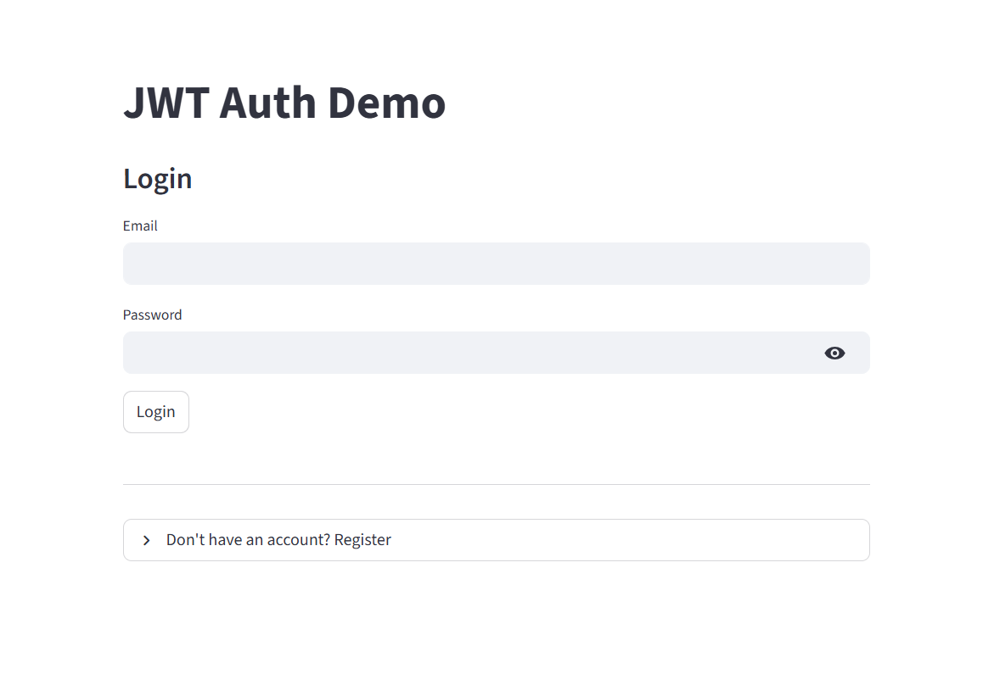
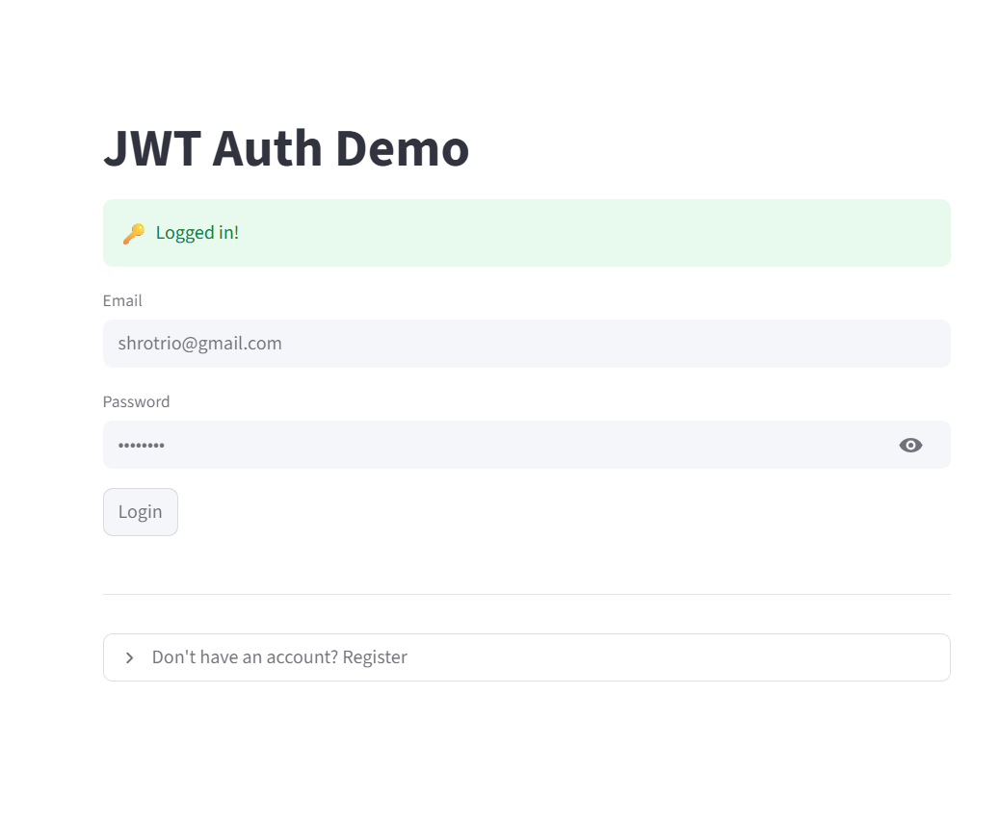
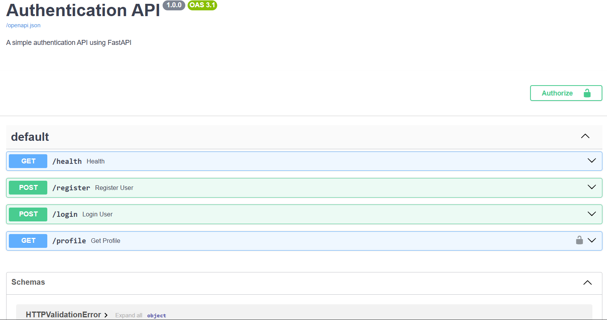

# 🔐 JWT Auth System (FastAPI + Argon2)

A production-pattern authentication system with secure password hashing, JWT tokens, and protected routes.

## 🚀 Features
✅ **Argon2 password hashing** (modern, no 72-byte limit)  
✅ **User registration** with Pydantic validation  
✅ **JWT token generation** with automatic expiry  
✅ **Protected routes** via FastAPI `Depends()`  
✅ **Persistent storage** (JSON file survives restarts)  
✅ **Streamlit login UI** with session management  
✅ **Auto-generated API docs** (`/docs` Swagger UI)

## 🛠️ Tech Stack
- **Backend**: FastAPI, Pydantic, Passlib (Argon2), Python-Jose (JWT)
- **Frontend**: Streamlit, Requests
- **Security**: OAuth2PasswordBearer, Dependency Injection, bcrypt → Argon2 upgrade
- **Storage**: JSON file (learning) → PostgreSQL (next project)

## 📦 Local Setup
```bash
# Install dependencies
pip install -r requirements.txt

# Run backend
uvicorn src.main:app --reload

# Run frontend (new terminal)
streamlit run frontend/login_ui.py


## 📸 Screenshots

### Login Page


### Profile (After Login)


### API Documentation

